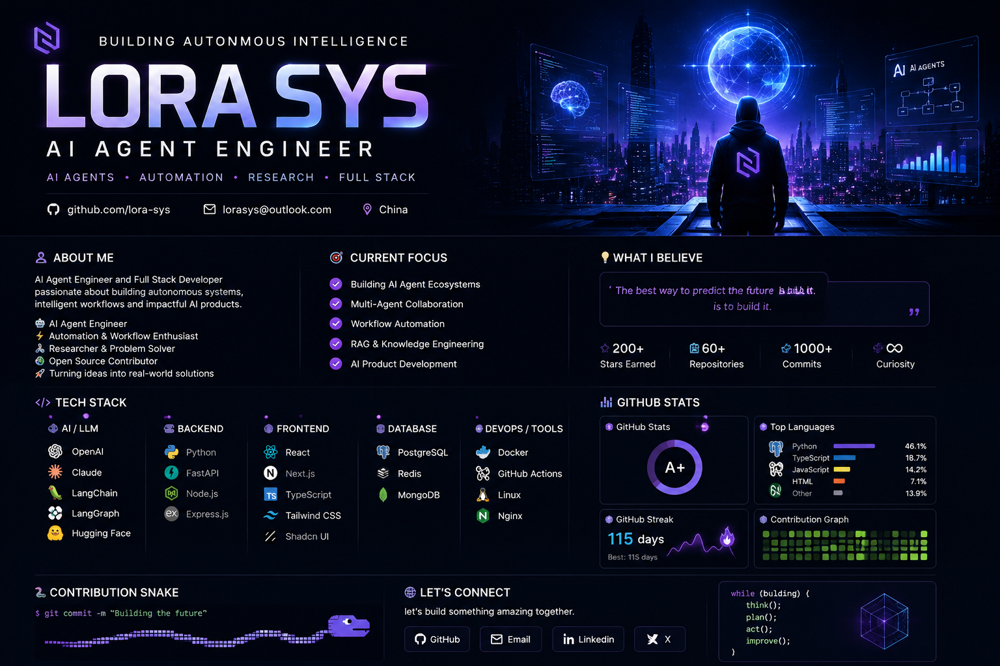

  

<h1 align="center">
  
</h1>

  <b>AI Agent Engineer · Open Source Builder · Full Stack Developer</b>

Building autonomous AI systems, research workflows and intelligent products.

  
  
  

---

## 🧠 About Me

- 👋 Hi, I’m **Lora Sys**  
- 🤖 AI Agent Engineer & Open Source Builder  
- 🎯 Focused on AI workflow automation, multi-agent collaboration, and LLM infrastructure  
- 💡 Passionate about building autonomous AI systems that solve real-world problems  
- 🌐 Based in China  

---

## 🎯 Current Focus

- Multi-Agent Systems  
- AI Workflow Automation  
- RAG Architectures  
- Knowledge Engineering  
- AI Product Development  

---

## ⚔️ Tech Arsenal

### AI / LLM

### Backend

### Frontend

### Database

### DevOps

---

## 📊 GitHub Stats

  
  

  

---

## 🐍 Contribution Snake

  

---

## 🌌 Mission

> Building AI Agents That Think, Plan and Act.  
> Turning ideas into autonomous systems and intelligent workflows.

---

## 📫 Connect With Me

  

  

  

⭐ Thanks for visiting my profile!

