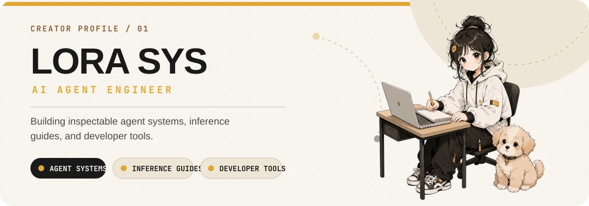

<!-- Lora approved profile v5. Asset provenance: output/v5/sources.json. -->

<picture><source media="(prefers-reduced-motion: reduce) and (max-width: 360px) and (prefers-color-scheme: dark)" srcset="https://raw.githubusercontent.com/lora-sys/lora-sys/output/v5/typing-dark-small-static.svg"><source media="(prefers-reduced-motion: reduce) and (max-width: 360px)" srcset="https://raw.githubusercontent.com/lora-sys/lora-sys/output/v5/typing-light-small-static.svg"><source media="(prefers-reduced-motion: reduce) and (max-width: 680px) and (prefers-color-scheme: dark)" srcset="https://raw.githubusercontent.com/lora-sys/lora-sys/output/v5/typing-dark-mobile-static.svg"><source media="(prefers-reduced-motion: reduce) and (max-width: 680px)" srcset="https://raw.githubusercontent.com/lora-sys/lora-sys/output/v5/typing-light-mobile-static.svg"><source media="(prefers-reduced-motion: reduce) and (prefers-color-scheme: dark)" srcset="https://raw.githubusercontent.com/lora-sys/lora-sys/output/v5/typing-dark-desktop-static.svg"><source media="(prefers-reduced-motion: reduce)" srcset="https://raw.githubusercontent.com/lora-sys/lora-sys/output/v5/typing-light-desktop-static.svg"><source media="(max-width: 360px) and (prefers-color-scheme: dark)" srcset="https://raw.githubusercontent.com/lora-sys/lora-sys/output/v5/typing-dark-small.svg"><source media="(max-width: 360px)" srcset="https://raw.githubusercontent.com/lora-sys/lora-sys/output/v5/typing-light-small.svg"><source media="(max-width: 680px) and (prefers-color-scheme: dark)" srcset="https://raw.githubusercontent.com/lora-sys/lora-sys/output/v5/typing-dark-mobile.svg"><source media="(max-width: 680px)" srcset="https://raw.githubusercontent.com/lora-sys/lora-sys/output/v5/typing-light-mobile.svg"><source media="(prefers-color-scheme: dark)" srcset="https://raw.githubusercontent.com/lora-sys/lora-sys/output/v5/typing-dark-desktop.svg"></picture>

我做 AI 应用和开发者工具，也把读源码的过程做成交互教程。 正在开发 <a href="https://github.com/lora-sys/Glassbox-Agent-Harness">Glassbox</a>，研究个人 Agent 的记忆、权限与任务执行。

<a href="https://lora-sys.github.io/loraSys/"><picture><source media="(max-width: 360px) and (prefers-color-scheme: dark)" srcset="https://raw.githubusercontent.com/lora-sys/lora-sys/output/v5/nav-0-dark-small.svg"><source media="(max-width: 360px)" srcset="https://raw.githubusercontent.com/lora-sys/lora-sys/output/v5/nav-0-light-small.svg"><source media="(max-width: 680px) and (prefers-color-scheme: dark)" srcset="https://raw.githubusercontent.com/lora-sys/lora-sys/output/v5/nav-0-dark-mobile.svg"><source media="(max-width: 680px)" srcset="https://raw.githubusercontent.com/lora-sys/lora-sys/output/v5/nav-0-light-mobile.svg"><source media="(prefers-color-scheme: dark)" srcset="https://raw.githubusercontent.com/lora-sys/lora-sys/output/v5/nav-0-dark-desktop.svg"></picture></a>
<a href="https://lora-sys.github.io/loraSys/projects"><picture><source media="(max-width: 360px) and (prefers-color-scheme: dark)" srcset="https://raw.githubusercontent.com/lora-sys/lora-sys/output/v5/nav-1-dark-small.svg"><source media="(max-width: 360px)" srcset="https://raw.githubusercontent.com/lora-sys/lora-sys/output/v5/nav-1-light-small.svg"><source media="(max-width: 680px) and (prefers-color-scheme: dark)" srcset="https://raw.githubusercontent.com/lora-sys/lora-sys/output/v5/nav-1-dark-mobile.svg"><source media="(max-width: 680px)" srcset="https://raw.githubusercontent.com/lora-sys/lora-sys/output/v5/nav-1-light-mobile.svg"><source media="(prefers-color-scheme: dark)" srcset="https://raw.githubusercontent.com/lora-sys/lora-sys/output/v5/nav-1-dark-desktop.svg"></picture></a>
<a href="https://lora-sys.github.io/loraSys/blog"><picture><source media="(max-width: 360px) and (prefers-color-scheme: dark)" srcset="https://raw.githubusercontent.com/lora-sys/lora-sys/output/v5/nav-2-dark-small.svg"><source media="(max-width: 360px)" srcset="https://raw.githubusercontent.com/lora-sys/lora-sys/output/v5/nav-2-light-small.svg"><source media="(max-width: 680px) and (prefers-color-scheme: dark)" srcset="https://raw.githubusercontent.com/lora-sys/lora-sys/output/v5/nav-2-dark-mobile.svg"><source media="(max-width: 680px)" srcset="https://raw.githubusercontent.com/lora-sys/lora-sys/output/v5/nav-2-light-mobile.svg"><source media="(prefers-color-scheme: dark)" srcset="https://raw.githubusercontent.com/lora-sys/lora-sys/output/v5/nav-2-dark-desktop.svg"></picture></a>
<a href="mailto:lorasys@outlook.com"><picture><source media="(max-width: 360px) and (prefers-color-scheme: dark)" srcset="https://raw.githubusercontent.com/lora-sys/lora-sys/output/v5/nav-3-dark-small.svg"><source media="(max-width: 360px)" srcset="https://raw.githubusercontent.com/lora-sys/lora-sys/output/v5/nav-3-light-small.svg"><source media="(max-width: 680px) and (prefers-color-scheme: dark)" srcset="https://raw.githubusercontent.com/lora-sys/lora-sys/output/v5/nav-3-dark-mobile.svg"><source media="(max-width: 680px)" srcset="https://raw.githubusercontent.com/lora-sys/lora-sys/output/v5/nav-3-light-mobile.svg"><source media="(prefers-color-scheme: dark)" srcset="https://raw.githubusercontent.com/lora-sys/lora-sys/output/v5/nav-3-dark-desktop.svg"></picture></a>

<picture><source media="(max-width: 360px) and (prefers-color-scheme: dark)" srcset="https://raw.githubusercontent.com/lora-sys/lora-sys/output/v5/divider-dark-small.svg"><source media="(max-width: 360px)" srcset="https://raw.githubusercontent.com/lora-sys/lora-sys/output/v5/divider-light-small.svg"><source media="(max-width: 680px) and (prefers-color-scheme: dark)" srcset="https://raw.githubusercontent.com/lora-sys/lora-sys/output/v5/divider-dark-mobile.svg"><source media="(max-width: 680px)" srcset="https://raw.githubusercontent.com/lora-sys/lora-sys/output/v5/divider-light-mobile.svg"><source media="(prefers-color-scheme: dark)" srcset="https://raw.githubusercontent.com/lora-sys/lora-sys/output/v5/divider-dark-desktop.svg"></picture>

<a href="https://lora-sys.github.io/loraSys/projects"><picture><source media="(max-width: 360px) and (prefers-color-scheme: dark)" srcset="https://raw.githubusercontent.com/lora-sys/lora-sys/output/v5/heading-work-dark-small.svg"><source media="(max-width: 360px)" srcset="https://raw.githubusercontent.com/lora-sys/lora-sys/output/v5/heading-work-light-small.svg"><source media="(max-width: 680px) and (prefers-color-scheme: dark)" srcset="https://raw.githubusercontent.com/lora-sys/lora-sys/output/v5/heading-work-dark-mobile.svg"><source media="(max-width: 680px)" srcset="https://raw.githubusercontent.com/lora-sys/lora-sys/output/v5/heading-work-light-mobile.svg"><source media="(prefers-color-scheme: dark)" srcset="https://raw.githubusercontent.com/lora-sys/lora-sys/output/v5/heading-work-dark-desktop.svg"></picture></a>

<a href="https://github.com/lora-sys/Glassbox-Agent-Harness"><picture><source media="(max-width: 360px) and (prefers-color-scheme: dark)" srcset="https://raw.githubusercontent.com/lora-sys/lora-sys/output/v5/feature-glassbox-dark-small.svg"><source media="(max-width: 360px)" srcset="https://raw.githubusercontent.com/lora-sys/lora-sys/output/v5/feature-glassbox-light-small.svg"><source media="(max-width: 680px) and (prefers-color-scheme: dark)" srcset="https://raw.githubusercontent.com/lora-sys/lora-sys/output/v5/feature-glassbox-dark-mobile.svg"><source media="(max-width: 680px)" srcset="https://raw.githubusercontent.com/lora-sys/lora-sys/output/v5/feature-glassbox-light-mobile.svg"><source media="(prefers-color-scheme: dark)" srcset="https://raw.githubusercontent.com/lora-sys/lora-sys/output/v5/feature-glassbox-dark-desktop.svg"></picture></a>
<a href="https://github.com/lora-sys/zhihu-threads"><picture><source media="(max-width: 360px) and (prefers-color-scheme: dark)" srcset="https://raw.githubusercontent.com/lora-sys/lora-sys/output/v5/feature-zhihu-dark-small.svg"><source media="(max-width: 360px)" srcset="https://raw.githubusercontent.com/lora-sys/lora-sys/output/v5/feature-zhihu-light-small.svg"><source media="(max-width: 680px) and (prefers-color-scheme: dark)" srcset="https://raw.githubusercontent.com/lora-sys/lora-sys/output/v5/feature-zhihu-dark-mobile.svg"><source media="(max-width: 680px)" srcset="https://raw.githubusercontent.com/lora-sys/lora-sys/output/v5/feature-zhihu-light-mobile.svg"><source media="(prefers-color-scheme: dark)" srcset="https://raw.githubusercontent.com/lora-sys/lora-sys/output/v5/feature-zhihu-dark-desktop.svg"></picture></a>

<a href="https://github.com/lora-sys/Glassbox-Agent-Harness/blob/main/.plans/03-personal-agent-foundation.md">Glassbox 当前计划</a> · <a href="https://github.com/lora-sys/zhihu-threads#快速开始">Zhihu Threads 使用说明</a>

工具、实验与教程

<a href="https://github.com/lora-sys/AgentArena"><picture><source media="(max-width: 360px) and (prefers-color-scheme: dark)" srcset="https://raw.githubusercontent.com/lora-sys/lora-sys/output/v5/compact-arena-dark-small.svg"><source media="(max-width: 360px)" srcset="https://raw.githubusercontent.com/lora-sys/lora-sys/output/v5/compact-arena-light-small.svg"><source media="(max-width: 680px) and (prefers-color-scheme: dark)" srcset="https://raw.githubusercontent.com/lora-sys/lora-sys/output/v5/compact-arena-dark-mobile.svg"><source media="(max-width: 680px)" srcset="https://raw.githubusercontent.com/lora-sys/lora-sys/output/v5/compact-arena-light-mobile.svg"><source media="(prefers-color-scheme: dark)" srcset="https://raw.githubusercontent.com/lora-sys/lora-sys/output/v5/compact-arena-dark-desktop.svg"></picture></a>
<a href="https://github.com/lora-sys/skills#安装"><picture><source media="(max-width: 360px) and (prefers-color-scheme: dark)" srcset="https://raw.githubusercontent.com/lora-sys/lora-sys/output/v5/compact-skills-dark-small.svg"><source media="(max-width: 360px)" srcset="https://raw.githubusercontent.com/lora-sys/lora-sys/output/v5/compact-skills-light-small.svg"><source media="(max-width: 680px) and (prefers-color-scheme: dark)" srcset="https://raw.githubusercontent.com/lora-sys/lora-sys/output/v5/compact-skills-dark-mobile.svg"><source media="(max-width: 680px)" srcset="https://raw.githubusercontent.com/lora-sys/lora-sys/output/v5/compact-skills-light-mobile.svg"><source media="(prefers-color-scheme: dark)" srcset="https://raw.githubusercontent.com/lora-sys/lora-sys/output/v5/compact-skills-dark-desktop.svg"></picture></a>
<a href="https://lora-sys.github.io/nano-vllm-interactive-guide/guide/00-start"><picture><source media="(max-width: 360px) and (prefers-color-scheme: dark)" srcset="https://raw.githubusercontent.com/lora-sys/lora-sys/output/v5/compact-vllm-dark-small.svg"><source media="(max-width: 360px)" srcset="https://raw.githubusercontent.com/lora-sys/lora-sys/output/v5/compact-vllm-light-small.svg"><source media="(max-width: 680px) and (prefers-color-scheme: dark)" srcset="https://raw.githubusercontent.com/lora-sys/lora-sys/output/v5/compact-vllm-dark-mobile.svg"><source media="(max-width: 680px)" srcset="https://raw.githubusercontent.com/lora-sys/lora-sys/output/v5/compact-vllm-light-mobile.svg"><source media="(prefers-color-scheme: dark)" srcset="https://raw.githubusercontent.com/lora-sys/lora-sys/output/v5/compact-vllm-dark-desktop.svg"></picture></a>
<a href="https://github.com/lora-sys/free-vision-skill#使用"><picture><source media="(max-width: 360px) and (prefers-color-scheme: dark)" srcset="https://raw.githubusercontent.com/lora-sys/lora-sys/output/v5/compact-vision-dark-small.svg"><source media="(max-width: 360px)" srcset="https://raw.githubusercontent.com/lora-sys/lora-sys/output/v5/compact-vision-light-small.svg"><source media="(max-width: 680px) and (prefers-color-scheme: dark)" srcset="https://raw.githubusercontent.com/lora-sys/lora-sys/output/v5/compact-vision-dark-mobile.svg"><source media="(max-width: 680px)" srcset="https://raw.githubusercontent.com/lora-sys/lora-sys/output/v5/compact-vision-light-mobile.svg"><source media="(prefers-color-scheme: dark)" srcset="https://raw.githubusercontent.com/lora-sys/lora-sys/output/v5/compact-vision-dark-desktop.svg"></picture></a>

[AI Engineering Harness](https://github.com/lora-sys/ai-engineering-harness) · 更多工程工作流见仓库。

<picture><source media="(max-width: 360px) and (prefers-color-scheme: dark)" srcset="https://raw.githubusercontent.com/lora-sys/lora-sys/output/v5/heading-tool-dark-small.svg"><source media="(max-width: 360px)" srcset="https://raw.githubusercontent.com/lora-sys/lora-sys/output/v5/heading-tool-light-small.svg"><source media="(max-width: 680px) and (prefers-color-scheme: dark)" srcset="https://raw.githubusercontent.com/lora-sys/lora-sys/output/v5/heading-tool-dark-mobile.svg"><source media="(max-width: 680px)" srcset="https://raw.githubusercontent.com/lora-sys/lora-sys/output/v5/heading-tool-light-mobile.svg"><source media="(prefers-color-scheme: dark)" srcset="https://raw.githubusercontent.com/lora-sys/lora-sys/output/v5/heading-tool-dark-desktop.svg"></picture>

<a href="https://github.com/lora-sys/zhihu-threads/blob/main/package.json"><picture><source media="(max-width: 360px) and (prefers-color-scheme: dark)" srcset="https://raw.githubusercontent.com/lora-sys/lora-sys/output/v5/tool-0-dark-small.svg"><source media="(max-width: 360px)" srcset="https://raw.githubusercontent.com/lora-sys/lora-sys/output/v5/tool-0-light-small.svg"><source media="(max-width: 680px) and (prefers-color-scheme: dark)" srcset="https://raw.githubusercontent.com/lora-sys/lora-sys/output/v5/tool-0-dark-mobile.svg"><source media="(max-width: 680px)" srcset="https://raw.githubusercontent.com/lora-sys/lora-sys/output/v5/tool-0-light-mobile.svg"><source media="(prefers-color-scheme: dark)" srcset="https://raw.githubusercontent.com/lora-sys/lora-sys/output/v5/tool-0-dark-desktop.svg"></picture></a>
<a href="https://github.com/lora-sys/Glassbox-Agent-Harness/blob/main/package.json"><picture><source media="(max-width: 360px) and (prefers-color-scheme: dark)" srcset="https://raw.githubusercontent.com/lora-sys/lora-sys/output/v5/tool-1-dark-small.svg"><source media="(max-width: 360px)" srcset="https://raw.githubusercontent.com/lora-sys/lora-sys/output/v5/tool-1-light-small.svg"><source media="(max-width: 680px) and (prefers-color-scheme: dark)" srcset="https://raw.githubusercontent.com/lora-sys/lora-sys/output/v5/tool-1-dark-mobile.svg"><source media="(max-width: 680px)" srcset="https://raw.githubusercontent.com/lora-sys/lora-sys/output/v5/tool-1-light-mobile.svg"><source media="(prefers-color-scheme: dark)" srcset="https://raw.githubusercontent.com/lora-sys/lora-sys/output/v5/tool-1-dark-desktop.svg"></picture></a>
<a href="https://github.com/lora-sys/zhihu-threads/blob/main/package.json"><picture><source media="(max-width: 360px) and (prefers-color-scheme: dark)" srcset="https://raw.githubusercontent.com/lora-sys/lora-sys/output/v5/tool-2-dark-small.svg"><source media="(max-width: 360px)" srcset="https://raw.githubusercontent.com/lora-sys/lora-sys/output/v5/tool-2-light-small.svg"><source media="(max-width: 680px) and (prefers-color-scheme: dark)" srcset="https://raw.githubusercontent.com/lora-sys/lora-sys/output/v5/tool-2-dark-mobile.svg"><source media="(max-width: 680px)" srcset="https://raw.githubusercontent.com/lora-sys/lora-sys/output/v5/tool-2-light-mobile.svg"><source media="(prefers-color-scheme: dark)" srcset="https://raw.githubusercontent.com/lora-sys/lora-sys/output/v5/tool-2-dark-desktop.svg"></picture></a>
<a href="https://github.com/lora-sys/zhihu-threads/blob/main/package.json"><picture><source media="(max-width: 360px) and (prefers-color-scheme: dark)" srcset="https://raw.githubusercontent.com/lora-sys/lora-sys/output/v5/tool-3-dark-small.svg"><source media="(max-width: 360px)" srcset="https://raw.githubusercontent.com/lora-sys/lora-sys/output/v5/tool-3-light-small.svg"><source media="(max-width: 680px) and (prefers-color-scheme: dark)" srcset="https://raw.githubusercontent.com/lora-sys/lora-sys/output/v5/tool-3-dark-mobile.svg"><source media="(max-width: 680px)" srcset="https://raw.githubusercontent.com/lora-sys/lora-sys/output/v5/tool-3-light-mobile.svg"><source media="(prefers-color-scheme: dark)" srcset="https://raw.githubusercontent.com/lora-sys/lora-sys/output/v5/tool-3-dark-desktop.svg"></picture></a>
<a href="https://github.com/lora-sys/zhihu-threads/blob/main/package.json"><picture><source media="(max-width: 360px) and (prefers-color-scheme: dark)" srcset="https://raw.githubusercontent.com/lora-sys/lora-sys/output/v5/tool-4-dark-small.svg"><source media="(max-width: 360px)" srcset="https://raw.githubusercontent.com/lora-sys/lora-sys/output/v5/tool-4-light-small.svg"><source media="(max-width: 680px) and (prefers-color-scheme: dark)" srcset="https://raw.githubusercontent.com/lora-sys/lora-sys/output/v5/tool-4-dark-mobile.svg"><source media="(max-width: 680px)" srcset="https://raw.githubusercontent.com/lora-sys/lora-sys/output/v5/tool-4-light-mobile.svg"><source media="(prefers-color-scheme: dark)" srcset="https://raw.githubusercontent.com/lora-sys/lora-sys/output/v5/tool-4-dark-desktop.svg"></picture></a>
<a href="https://github.com/lora-sys/zhihu-threads/blob/main/package.json"><picture><source media="(max-width: 360px) and (prefers-color-scheme: dark)" srcset="https://raw.githubusercontent.com/lora-sys/lora-sys/output/v5/tool-5-dark-small.svg"><source media="(max-width: 360px)" srcset="https://raw.githubusercontent.com/lora-sys/lora-sys/output/v5/tool-5-light-small.svg"><source media="(max-width: 680px) and (prefers-color-scheme: dark)" srcset="https://raw.githubusercontent.com/lora-sys/lora-sys/output/v5/tool-5-dark-mobile.svg"><source media="(max-width: 680px)" srcset="https://raw.githubusercontent.com/lora-sys/lora-sys/output/v5/tool-5-light-mobile.svg"><source media="(prefers-color-scheme: dark)" srcset="https://raw.githubusercontent.com/lora-sys/lora-sys/output/v5/tool-5-dark-desktop.svg"></picture></a>
<a href="https://github.com/lora-sys/Glassbox-Agent-Harness/blob/main/package.json"><picture><source media="(max-width: 360px) and (prefers-color-scheme: dark)" srcset="https://raw.githubusercontent.com/lora-sys/lora-sys/output/v5/tool-6-dark-small.svg"><source media="(max-width: 360px)" srcset="https://raw.githubusercontent.com/lora-sys/lora-sys/output/v5/tool-6-light-small.svg"><source media="(max-width: 680px) and (prefers-color-scheme: dark)" srcset="https://raw.githubusercontent.com/lora-sys/lora-sys/output/v5/tool-6-dark-mobile.svg"><source media="(max-width: 680px)" srcset="https://raw.githubusercontent.com/lora-sys/lora-sys/output/v5/tool-6-light-mobile.svg"><source media="(prefers-color-scheme: dark)" srcset="https://raw.githubusercontent.com/lora-sys/lora-sys/output/v5/tool-6-dark-desktop.svg"></picture></a>
<a href="https://github.com/lora-sys/Glassbox-Agent-Harness/blob/main/package.json"><picture><source media="(max-width: 360px) and (prefers-color-scheme: dark)" srcset="https://raw.githubusercontent.com/lora-sys/lora-sys/output/v5/tool-7-dark-small.svg"><source media="(max-width: 360px)" srcset="https://raw.githubusercontent.com/lora-sys/lora-sys/output/v5/tool-7-light-small.svg"><source media="(max-width: 680px) and (prefers-color-scheme: dark)" srcset="https://raw.githubusercontent.com/lora-sys/lora-sys/output/v5/tool-7-dark-mobile.svg"><source media="(max-width: 680px)" srcset="https://raw.githubusercontent.com/lora-sys/lora-sys/output/v5/tool-7-light-mobile.svg"><source media="(prefers-color-scheme: dark)" srcset="https://raw.githubusercontent.com/lora-sys/lora-sys/output/v5/tool-7-dark-desktop.svg"></picture></a>

用于应用开发、数据存储和测试。点击图标查看项目依赖。

<picture><source media="(max-width: 360px) and (prefers-color-scheme: dark)" srcset="https://raw.githubusercontent.com/lora-sys/lora-sys/output/v5/heading-stats-dark-small.svg"><source media="(max-width: 360px)" srcset="https://raw.githubusercontent.com/lora-sys/lora-sys/output/v5/heading-stats-light-small.svg"><source media="(max-width: 680px) and (prefers-color-scheme: dark)" srcset="https://raw.githubusercontent.com/lora-sys/lora-sys/output/v5/heading-stats-dark-mobile.svg"><source media="(max-width: 680px)" srcset="https://raw.githubusercontent.com/lora-sys/lora-sys/output/v5/heading-stats-light-mobile.svg"><source media="(prefers-color-scheme: dark)" srcset="https://raw.githubusercontent.com/lora-sys/lora-sys/output/v5/heading-stats-dark-desktop.svg"></picture>

<a href="https://github-readme-stats-fast.vercel.app/api?username=lora-sys"><picture><source media="(max-width: 360px) and (prefers-color-scheme: dark)" srcset="https://raw.githubusercontent.com/lora-sys/lora-sys/output/v5/overview-dark-small.svg"><source media="(max-width: 360px)" srcset="https://raw.githubusercontent.com/lora-sys/lora-sys/output/v5/overview-light-small.svg"><source media="(max-width: 680px) and (prefers-color-scheme: dark)" srcset="https://raw.githubusercontent.com/lora-sys/lora-sys/output/v5/overview-dark-mobile.svg"><source media="(max-width: 680px)" srcset="https://raw.githubusercontent.com/lora-sys/lora-sys/output/v5/overview-light-mobile.svg"><source media="(prefers-color-scheme: dark)" srcset="https://raw.githubusercontent.com/lora-sys/lora-sys/output/v5/overview-dark-desktop.svg"></picture></a>
<a href="https://github-readme-stats-sigma-fawn-45.vercel.app/api/top-langs/?username=lora-sys"><picture><source media="(max-width: 360px) and (prefers-color-scheme: dark)" srcset="https://raw.githubusercontent.com/lora-sys/lora-sys/output/v5/languages-dark-small.svg"><source media="(max-width: 360px)" srcset="https://raw.githubusercontent.com/lora-sys/lora-sys/output/v5/languages-light-small.svg"><source media="(max-width: 680px) and (prefers-color-scheme: dark)" srcset="https://raw.githubusercontent.com/lora-sys/lora-sys/output/v5/languages-dark-mobile.svg"><source media="(max-width: 680px)" srcset="https://raw.githubusercontent.com/lora-sys/lora-sys/output/v5/languages-light-mobile.svg"><source media="(prefers-color-scheme: dark)" srcset="https://raw.githubusercontent.com/lora-sys/lora-sys/output/v5/languages-dark-desktop.svg"></picture></a>

总览来自 Stats Fast，保留字母等级。语言分布来自自托管服务，不代表熟练度。

<a href="https://github-readme-streak-stats-eight.vercel.app/?user=lora-sys"><picture><source media="(max-width: 360px) and (prefers-color-scheme: dark)" srcset="https://raw.githubusercontent.com/lora-sys/lora-sys/output/v5/streak-dark-small.svg"><source media="(max-width: 360px)" srcset="https://raw.githubusercontent.com/lora-sys/lora-sys/output/v5/streak-light-small.svg"><source media="(max-width: 680px) and (prefers-color-scheme: dark)" srcset="https://raw.githubusercontent.com/lora-sys/lora-sys/output/v5/streak-dark-mobile.svg"><source media="(max-width: 680px)" srcset="https://raw.githubusercontent.com/lora-sys/lora-sys/output/v5/streak-light-mobile.svg"><source media="(prefers-color-scheme: dark)" srcset="https://raw.githubusercontent.com/lora-sys/lora-sys/output/v5/streak-dark-desktop.svg"></picture></a>

<a href="https://github.com/Platane/snk"><picture><source media="(prefers-reduced-motion: reduce) and (max-width: 360px) and (prefers-color-scheme: dark)" srcset="https://raw.githubusercontent.com/lora-sys/lora-sys/output/v5/snake-dark-small-static.svg"><source media="(prefers-reduced-motion: reduce) and (max-width: 360px)" srcset="https://raw.githubusercontent.com/lora-sys/lora-sys/output/v5/snake-light-small-static.svg"><source media="(prefers-reduced-motion: reduce) and (max-width: 680px) and (prefers-color-scheme: dark)" srcset="https://raw.githubusercontent.com/lora-sys/lora-sys/output/v5/snake-dark-mobile-static.svg"><source media="(prefers-reduced-motion: reduce) and (max-width: 680px)" srcset="https://raw.githubusercontent.com/lora-sys/lora-sys/output/v5/snake-light-mobile-static.svg"><source media="(prefers-reduced-motion: reduce) and (prefers-color-scheme: dark)" srcset="https://raw.githubusercontent.com/lora-sys/lora-sys/output/v5/snake-dark-desktop-static.svg"><source media="(prefers-reduced-motion: reduce)" srcset="https://raw.githubusercontent.com/lora-sys/lora-sys/output/v5/snake-light-desktop-static.svg"><source media="(max-width: 360px) and (prefers-color-scheme: dark)" srcset="https://raw.githubusercontent.com/lora-sys/lora-sys/output/v5/snake-dark-small.svg"><source media="(max-width: 360px)" srcset="https://raw.githubusercontent.com/lora-sys/lora-sys/output/v5/snake-light-small.svg"><source media="(max-width: 680px) and (prefers-color-scheme: dark)" srcset="https://raw.githubusercontent.com/lora-sys/lora-sys/output/v5/snake-dark-mobile.svg"><source media="(max-width: 680px)" srcset="https://raw.githubusercontent.com/lora-sys/lora-sys/output/v5/snake-light-mobile.svg"><source media="(prefers-color-scheme: dark)" srcset="https://raw.githubusercontent.com/lora-sys/lora-sys/output/v5/snake-dark-desktop.svg"></picture></a>

统计与动画每日刷新。接口失败时保留上一次成功结果。<a href="https://raw.githubusercontent.com/lora-sys/lora-sys/output/v5/sources.json">数据来源与更新时间</a>

<a href="https://lora-sys.github.io/loraSys/blog"><picture><source media="(max-width: 360px) and (prefers-color-scheme: dark)" srcset="https://raw.githubusercontent.com/lora-sys/lora-sys/output/v5/heading-writing-dark-small.svg"><source media="(max-width: 360px)" srcset="https://raw.githubusercontent.com/lora-sys/lora-sys/output/v5/heading-writing-light-small.svg"><source media="(max-width: 680px) and (prefers-color-scheme: dark)" srcset="https://raw.githubusercontent.com/lora-sys/lora-sys/output/v5/heading-writing-dark-mobile.svg"><source media="(max-width: 680px)" srcset="https://raw.githubusercontent.com/lora-sys/lora-sys/output/v5/heading-writing-light-mobile.svg"><source media="(prefers-color-scheme: dark)" srcset="https://raw.githubusercontent.com/lora-sys/lora-sys/output/v5/heading-writing-dark-desktop.svg"></picture></a>

<a href="https://lora-sys.github.io/loraSys/blog/agent-budget-memory-evaluation"><picture><source media="(max-width: 360px) and (prefers-color-scheme: dark)" srcset="https://raw.githubusercontent.com/lora-sys/lora-sys/output/v5/article-budget-dark-small.svg"><source media="(max-width: 360px)" srcset="https://raw.githubusercontent.com/lora-sys/lora-sys/output/v5/article-budget-light-small.svg"><source media="(max-width: 680px) and (prefers-color-scheme: dark)" srcset="https://raw.githubusercontent.com/lora-sys/lora-sys/output/v5/article-budget-dark-mobile.svg"><source media="(max-width: 680px)" srcset="https://raw.githubusercontent.com/lora-sys/lora-sys/output/v5/article-budget-light-mobile.svg"><source media="(prefers-color-scheme: dark)" srcset="https://raw.githubusercontent.com/lora-sys/lora-sys/output/v5/article-budget-dark-desktop.svg"></picture></a>
<a href="https://lora-sys.github.io/loraSys/blog/tau-agent-architecture"><picture><source media="(max-width: 360px) and (prefers-color-scheme: dark)" srcset="https://raw.githubusercontent.com/lora-sys/lora-sys/output/v5/article-tau-dark-small.svg"><source media="(max-width: 360px)" srcset="https://raw.githubusercontent.com/lora-sys/lora-sys/output/v5/article-tau-light-small.svg"><source media="(max-width: 680px) and (prefers-color-scheme: dark)" srcset="https://raw.githubusercontent.com/lora-sys/lora-sys/output/v5/article-tau-dark-mobile.svg"><source media="(max-width: 680px)" srcset="https://raw.githubusercontent.com/lora-sys/lora-sys/output/v5/article-tau-light-mobile.svg"><source media="(prefers-color-scheme: dark)" srcset="https://raw.githubusercontent.com/lora-sys/lora-sys/output/v5/article-tau-dark-desktop.svg"></picture></a>
<a href="https://lora-sys.github.io/loraSys/blog/ai-engineering-harness"><picture><source media="(max-width: 360px) and (prefers-color-scheme: dark)" srcset="https://raw.githubusercontent.com/lora-sys/lora-sys/output/v5/article-harness-dark-small.svg"><source media="(max-width: 360px)" srcset="https://raw.githubusercontent.com/lora-sys/lora-sys/output/v5/article-harness-light-small.svg"><source media="(max-width: 680px) and (prefers-color-scheme: dark)" srcset="https://raw.githubusercontent.com/lora-sys/lora-sys/output/v5/article-harness-dark-mobile.svg"><source media="(max-width: 680px)" srcset="https://raw.githubusercontent.com/lora-sys/lora-sys/output/v5/article-harness-light-mobile.svg"><source media="(prefers-color-scheme: dark)" srcset="https://raw.githubusercontent.com/lora-sys/lora-sys/output/v5/article-harness-dark-desktop.svg"></picture></a>

<a href="https://github.com/search?q=author%3Alora-sys+is%3Apr+is%3Amerged&amp;type=pullrequests"><picture><source media="(max-width: 360px) and (prefers-color-scheme: dark)" srcset="https://raw.githubusercontent.com/lora-sys/lora-sys/output/v5/heading-contributions-dark-small.svg"><source media="(max-width: 360px)" srcset="https://raw.githubusercontent.com/lora-sys/lora-sys/output/v5/heading-contributions-light-small.svg"><source media="(max-width: 680px) and (prefers-color-scheme: dark)" srcset="https://raw.githubusercontent.com/lora-sys/lora-sys/output/v5/heading-contributions-dark-mobile.svg"><source media="(max-width: 680px)" srcset="https://raw.githubusercontent.com/lora-sys/lora-sys/output/v5/heading-contributions-light-mobile.svg"><source media="(prefers-color-scheme: dark)" srcset="https://raw.githubusercontent.com/lora-sys/lora-sys/output/v5/heading-contributions-dark-desktop.svg"></picture></a>

<a href="https://github.com/cloudwego/eino-examples/pull/227"><picture><source media="(max-width: 360px) and (prefers-color-scheme: dark)" srcset="https://raw.githubusercontent.com/lora-sys/lora-sys/output/v5/pr-eino-dark-small.svg"><source media="(max-width: 360px)" srcset="https://raw.githubusercontent.com/lora-sys/lora-sys/output/v5/pr-eino-light-small.svg"><source media="(max-width: 680px) and (prefers-color-scheme: dark)" srcset="https://raw.githubusercontent.com/lora-sys/lora-sys/output/v5/pr-eino-dark-mobile.svg"><source media="(max-width: 680px)" srcset="https://raw.githubusercontent.com/lora-sys/lora-sys/output/v5/pr-eino-light-mobile.svg"><source media="(prefers-color-scheme: dark)" srcset="https://raw.githubusercontent.com/lora-sys/lora-sys/output/v5/pr-eino-dark-desktop.svg"></picture></a>
<a href="https://github.com/portdeveloper/nad-agent/pull/49"><picture><source media="(max-width: 360px) and (prefers-color-scheme: dark)" srcset="https://raw.githubusercontent.com/lora-sys/lora-sys/output/v5/pr-nad-dark-small.svg"><source media="(max-width: 360px)" srcset="https://raw.githubusercontent.com/lora-sys/lora-sys/output/v5/pr-nad-light-small.svg"><source media="(max-width: 680px) and (prefers-color-scheme: dark)" srcset="https://raw.githubusercontent.com/lora-sys/lora-sys/output/v5/pr-nad-dark-mobile.svg"><source media="(max-width: 680px)" srcset="https://raw.githubusercontent.com/lora-sys/lora-sys/output/v5/pr-nad-light-mobile.svg"><source media="(prefers-color-scheme: dark)" srcset="https://raw.githubusercontent.com/lora-sys/lora-sys/output/v5/pr-nad-dark-desktop.svg"></picture></a>
<a href="https://github.com/nishuzumi/moss/pull/29"><picture><source media="(max-width: 360px) and (prefers-color-scheme: dark)" srcset="https://raw.githubusercontent.com/lora-sys/lora-sys/output/v5/pr-moss-dark-small.svg"><source media="(max-width: 360px)" srcset="https://raw.githubusercontent.com/lora-sys/lora-sys/output/v5/pr-moss-light-small.svg"><source media="(max-width: 680px) and (prefers-color-scheme: dark)" srcset="https://raw.githubusercontent.com/lora-sys/lora-sys/output/v5/pr-moss-dark-mobile.svg"><source media="(max-width: 680px)" srcset="https://raw.githubusercontent.com/lora-sys/lora-sys/output/v5/pr-moss-light-mobile.svg"><source media="(prefers-color-scheme: dark)" srcset="https://raw.githubusercontent.com/lora-sys/lora-sys/output/v5/pr-moss-dark-desktop.svg"></picture></a>

<a href="mailto:lorasys@outlook.com"><picture><source media="(max-width: 360px) and (prefers-color-scheme: dark)" srcset="https://raw.githubusercontent.com/lora-sys/lora-sys/output/v5/contact-dark-small.svg"><source media="(max-width: 360px)" srcset="https://raw.githubusercontent.com/lora-sys/lora-sys/output/v5/contact-light-small.svg"><source media="(max-width: 680px) and (prefers-color-scheme: dark)" srcset="https://raw.githubusercontent.com/lora-sys/lora-sys/output/v5/contact-dark-mobile.svg"><source media="(max-width: 680px)" srcset="https://raw.githubusercontent.com/lora-sys/lora-sys/output/v5/contact-light-mobile.svg"><source media="(prefers-color-scheme: dark)" srcset="https://raw.githubusercontent.com/lora-sys/lora-sys/output/v5/contact-dark-desktop.svg"></picture></a>

<a href="https://lora-sys.github.io/loraSys/">个人网站</a> · <a href="https://github.com/lora-sys">GitHub</a> · <a href="https://www.zhihu.com/people/lorry-23-28-30">知乎</a> · <a href="https://x.com/MierPiter33280">X</a>

Lora · lora-sys · <a href="#top">回到顶部</a>

文字目录与无图阅读

[项目插画](https://github.com/lora-sys/Glassbox-Agent-Harness)  
项目插画。PERSONAL AGENT。开发中。Glassbox。。开发中的个人 Agent 工作台，管理对话、权限与任务执行。。。当前在做 QQ 接入与任务执行流程。

[项目插画](https://github.com/lora-sys/zhihu-threads)  
项目插画。LEARNING APP。应用。Zhihu Threads。。把选中的知乎摘录整理成带来源的学习线，支持追问、自测和导出。。。用户选来源，AI 基于所选摘录回答。

[AgentArena](https://github.com/lora-sys/AgentArena)  
AgentArena。。让三支 Agent 团队处理同一任务，保留提案、证据与对战回放。。。多 Agent 实验。查看项目

[Lora Skills](https://github.com/lora-sys/skills#安装)  
Lora Skills。。按需安装的 Agent 工作流集合，涵盖工程、写作和内容发布。。。可安装工具。查看安装说明

[nano-vLLM 交互教程](https://lora-sys.github.io/nano-vllm-interactive-guide/guide/00-start)  
nano-vLLM 交互教程。。结合源码与浏览器实验，讲解推理调度、KV Cache 和采样。。。交互式源码教程。打开教程

[Free Vision Skill](https://github.com/lora-sys/free-vision-skill#使用)  
Free Vision Skill。。按任务提取图片中的相关信息，输出文本证据供 Agent 继续处理。。。开发者工具。查看使用方式

[01](https://lora-sys.github.io/loraSys/blog/agent-budget-memory-evaluation)  
01。论文阅读。2026.09.16。Agent 该继续跑，还是重新开一轮？。。同样一笔预算，是继续当前会话，还是重新尝试？结合记忆与评测拆解这个问题。

[02](https://lora-sys.github.io/loraSys/blog/tau-agent-architecture)  
02。架构与源码。2026.09.16。把 AI Agent 拆成三层。。以 Tau 为例，拆开模型适配、Agent 核心和应用界面，说明每一层负责什么。

[03](https://lora-sys.github.io/loraSys/blog/ai-engineering-harness)  
03。工程实践。2026.08.02。Agent 开发的测试与审查。。把 Issue、实现、测试、代码审查和验收记录组织成一次可检查的交付。

[cloudwego/eino-examples](https://github.com/cloudwego/eino-examples/pull/227)  
cloudwego/eino-examples。已合并。修复 Excel Agent 的计划与文件路径。。修正启动路径重复、计划步骤为空，以及文件工具写入目录不正确的问题。。。2026.05.25。查看 PR #227

[portdeveloper/nad-agent](https://github.com/portdeveloper/nad-agent/pull/49)  
portdeveloper/nad-agent。已合并。增加多账户切换与配置持久化。。在命令行列出和切换账户，保存当前选择，并让转账使用选中的账户。。。2026.08.18。查看 PR #49

[nishuzumi/moss](https://github.com/nishuzumi/moss/pull/29)  
nishuzumi/moss。已合并。增加合约 ABI 获取工具。。获取已验证的合约 ABI，生成 TypeScript 定义，并处理参数校验、错误与密钥脱敏。。。2026.07.19。查看 PR #29

邮箱 [lorasys@outlook.com](mailto:lorasys@outlook.com)。

