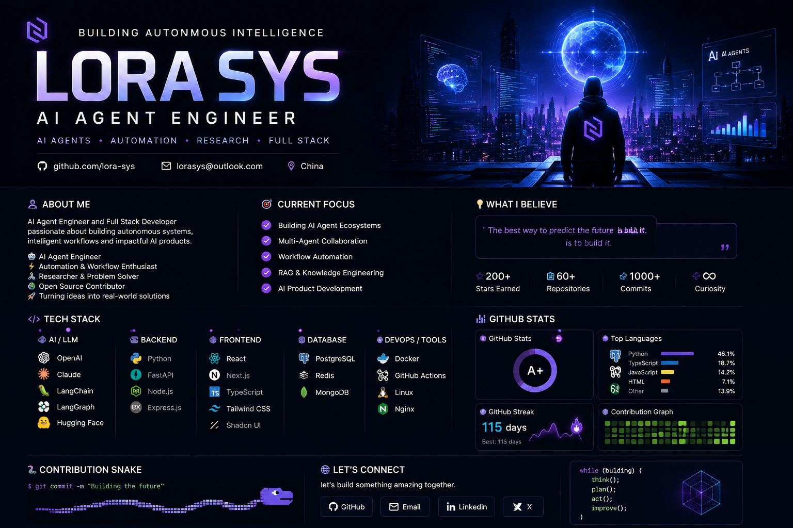

  

<h1 align="center">
  
</h1>

  👇 currently shipping · core stack · self-built projects

  
  
  

---

## 🧠 About Me

👋 I'm **Lora** — I build AI agents that ship.

- 🛠 Multi-agent SE tools · Claude / OpenAI plugin backends
- 🚀 Driving **[ReposTwin](https://github.com/ACAMLab/ReposTwin)**, **[ai-engineering-harness](https://github.com/lora-sys/ai-engineering-harness)**, and the Hermes plugin stack
- 🌏 China-based · working in public · always shipping

> Building the tools that build the agents. From prompt to production.

---

## 🛠 Currently Building

- 🐉 **[monadmon](https://github.com/lora-sys/monadmon)** — Monad 上第一批"活物"：链上养成 + PvP，正在补经济模型
- 🏢 **[aicompanyos](https://github.com/lora-sys/aicompanyos)** — AI 公司级 OS 雏形：PR / OKR / agent / 数据流统一面板
- 🤝 **[JonLinker](https://github.com/lora-sys/JonLinker)** — agent-to-agent 求职：resume 投递 + 对话自动化
- 🧠 **[second-brain](https://github.com/lora-sys/second-brain)** — Personal second-brain dashboard · Obsidian 同步
- 🔥 **[ai-engineering-harness](https://github.com/lora-sys/ai-engineering-harness)** — Multi-agent SE org harness with adversarial review + L0-L3 context
- 🚧 **[ReposTwin](https://github.com/ACAMLab/ReposTwin)** (ACAMLab) — 3D GitHub code galaxy with an AI agent sidebar · actively in development
- 📦 **[hermes-minimax-media](https://github.com/lora-sys/hermes-minimax-media)** + **[hermes-stepfun-imagegen](https://github.com/lora-sys/hermes-stepfun-imagegen)** — Hermes Agent backends for media generation
- 🌐 **[loraSys](https://github.com/lora-sys/loraSys)** — Svelte 个人站，部署在 GitHub Pages，正在迭代首页
- 🧱 **[Init-codebase](https://github.com/lora-sys/Init-codebase)** — agent 起步 skill：`读 CLAUDE.md → 扫依赖 → 跑测试 → 出任务卡片`

---

## ⚔️ Tech Arsenal

🏗️ Hand-curated stack · what's actually used across 41 self-built repos

| | |
|---|---|
| **Languages** |        |
| **AI · LLMs · Agents** |         |
| **Frontend · 3D · UI** |       |
| **Infra & DevOps** |          |

---

<!-- projects:start -->

## 🚀 Projects

> **44 self-built projects** across [`lora-sys`](https://github.com/lora-sys?tab=repositories) and [`ACAMLab`](https://github.com/ACAMLab) (dev org) · [**+27 earlier · WIP · private**](#earlier) · forks excluded.
>
> ⭐ **Top stars**: [nanochat-studay](https://github.com/ACAMLab/nanochat-studay) · 4★ · [mianshiya-next-lora](https://github.com/lora-sys/mianshiya-next-lora) · 3★

### ⭐ Featured

🔒 **[ReposTwin](https://github.com/ACAMLab/ReposTwin)** (ACAMLab) · the showcase of this profile · 3D GitHub code galaxy · currently in active development · not pinnable while private

### 🤖 AI Agents & Multi-Agent · 6

| Project | Stack | What |
|---|---|---|
| [NanoAgent](https://github.com/ACAMLab/NanoAgent) |  | Customisable agent framework |
| [Nanoagent-go](https://github.com/ACAMLab/Nanoagent-go) |  | NanoAgent ported to Go |
| [git-opilot](https://github.com/ACAMLab/git-opilot) |  | AI CLI for local Git repos · review, refactor, commit |
| [Pixel-Heart-OS-](https://github.com/ACAMLab/Pixel-Heart-OS-) |  | Emergent social-universe sim · AI co-editing + Git-style memory (Beads) |
| [hermes-stepfun-imagegen](https://github.com/lora-sys/hermes-stepfun-imagegen) |  | Hermes Agent backend · StepFun image generation (step-image-edit-2 / step-2x-large) |
| [WishLive](https://github.com/lora-sys/WishLive) |  | Live-music ecosystem · AI Agent + Web3 collaboration platform |

### 🐉 Web3 & On-chain Demos · 2

| Project | Stack | What |
|---|---|---|
| [monadmon](https://github.com/lora-sys/monadmon) |  | Monad 上链上养成 + PvP 对战：first living creatures on Monad |
| [Newtube-clone](https://github.com/lora-sys/Newtube-clone) |  | YouTube 风视频站 · AI 推荐 |

### 🎨 Apps & Sites · 16

| Project | Stack | What |
|---|---|---|
| [second-brain](https://github.com/lora-sys/second-brain) |  | Personal second-brain dashboard · Obsidian vault sync |
| [loraSys](https://github.com/lora-sys/loraSys) |  | Personal site · GitHub Pages (active) |
| [SCIDRAFT.AI](https://github.com/ACAMLab/SCIDRAFT.AI) |  | Science-paper writing platform |
| [TrandingOs](https://github.com/lora-sys/TrandingOs) |  | Personal trading operating system |
| [Lora-website](https://github.com/lora-sys/Lora-website) |  | Earlier personal website (legacy) |
| [Hackthon](https://github.com/lora-sys/Hackthon) |  | ETH Beijing hackathon entry |
| [demo_monad_hackthon](https://github.com/lora-sys/demo_monad_hackthon) |  | Monad hackathon demo |
| [meme-Vibe-Casino](https://github.com/lora-sys/meme-Vibe-Casino) |  | Vibe-coding meme casino · hackathon project |
| [RecruitDraft](https://github.com/lora-sys/RecruitDraft) |  | LinkedIn job-description generator with star-rule |
| [ResumeGenerator](https://github.com/ACAMLab/ResumeGenerator) |   | KaTeX / LaTeX resume generator |
| [ThreeJs-projects](https://github.com/lora-sys/ThreeJs-projects) |  | Interactive Sci-Fi control interface |
| [lora-bi](https://github.com/lora-sys/lora-bi) |  | Personal BI dashboard |
| [mianshihou-interview-website](https://github.com/lora-sys/mianshihou-interview-website) |  | Interview-prep website with backend |
| [automatic_compliments](https://github.com/lora-sys/automatic_compliments) |  | 自动夸人小助手 · auto compliment generator |

### 🛠 Developer Tools · 3

| Project | Stack | What |
|---|---|---|
| [redis-go](https://github.com/ACAMLab/redis-go) |  | Redis client/server · RESP protocol + data persistence |
| [Filehub](https://github.com/lora-sys/Filehub) |  | Local private-cloud file storage |
| [node-base](https://github.com/lora-sys/node-base) |  | AI workflow engine · n8n-style |

### 🧠 Skills & Prompts · 5

| Project | Stack | What |
|---|---|---|
| [Init-codebase](https://github.com/lora-sys/Init-codebase) |  | Bootstrap skills for agent coding work |
| [ui-design](https://github.com/lora-sys/ui-design) |  | Claude UI/UX design skill |
| [web3-frontend-ui-and-ux-reviewer](https://github.com/lora-sys/web3-frontend-ui-and-ux-reviewer) |  | Web3 frontend UI/UX review skill |
| [lora-skills](https://github.com/lora-sys/lora-skills) |  | Personal Claude skills distillation |
| [development-rules](https://github.com/lora-sys/development-rules) |  | Shared dev rules & workflows |

### 🔬 Research · Detection · 4

| Project | Stack | What |
|---|---|---|
| [Defect-Supervised](https://github.com/ACAMLab/Defect-Supervised) |  | Supervised defect detection |
| [Defect-Semi-supervised](https://github.com/ACAMLab/Defect-Semi-supervised) |  | Semi-supervised defect detection |
| [DIy-Model](https://github.com/ACAMLab/DIy-Model) |  | DIY-model training playground |
| [demo-repository](https://github.com/ACAMLab/demo-repository) |  | GitHub showcase template |

### 📚 Learning Path · 4

| Project | Stack | What |
|---|---|---|
| [nanochat-studay](https://github.com/ACAMLab/nanochat-studay) ⭐4 |  | Nanochat concept study · 4★ |
| [mianshiya-next-lora](https://github.com/lora-sys/mianshiya-next-lora) ⭐3 |  | Interview-prep platform · study project · 3★ |
| [neetcode-submissions](https://github.com/lora-sys/neetcode-submissions) |  | NeetCode.io problem submissions |
| [Snake](https://github.com/lora-sys/Snake) |  | Classic snake game |

---

<b>📦 Earlier experiments · WIP · Private (27 more)</b>

### 🧪 WIP & Earlier Experiments (20)

Projects without GitHub description or in early iteration. Listed for completeness; will be either promoted or archived.

**AI / Agent helpers**
- [hackthon-agent](https://github.com/lora-sys/hackthon-agent) — Hackathon-tuned AI agent
- [Dream-prop-generator](https://github.com/lora-sys/Dream-prop-generator) — Dream-prop generator
- [skills-manager](https://github.com/lora-sys/skills-manager) — Skills dashboard
- [aicompanyos](https://github.com/lora-sys/aicompanyos) — AI company OS concept

**Dev tools & apps**
- [Daily-Rss](https://github.com/lora-sys/Daily-Rss) — Daily RSS reader
- [fastgithub](https://github.com/lora-sys/fastgithub) — GitHub utilities
- [go-project](https://github.com/lora-sys/go-project) — Go learning project
- [better-auth-learn](https://github.com/lora-sys/better-auth-learn) — Better-auth learning
- [note-app](https://github.com/lora-sys/note-app) — Note-taking app
- [zchat-demo](https://github.com/lora-sys/zchat-demo) — Chat UI demo

**Skills & automation**
- [ui-aesthetic-improve](https://github.com/lora-sys/ui-aesthetic-improve) — UI polish workflow
- [humanize-write](https://github.com/lora-sys/humanize-write) — Humanize AI text

**Practice & mini-projects**
- [REACT-PRACEISE](https://github.com/lora-sys/REACT-PRACEISE) — Early React practice
- [React-Projects](https://github.com/lora-sys/React-Projects) — React practice
- [MIscroservice](https://github.com/lora-sys/MIscroservice) — Microservice practice (typo name)
- [demo](https://github.com/lora-sys/demo) — Generic demo
- [learn-toys](https://github.com/lora-sys/learn-toys) — Toys sandbox
- [cpp-projects](https://github.com/lora-sys/cpp-projects) — C++ practice
- [cs50](https://github.com/lora-sys/cs50) — CS50 coursework
- [mode-defect](https://github.com/lora-sys/mode-defect) — Defect-detection experiments

### 🔒 Active Private Development (7+7)

`lora-sys` private: `AgentArena` · `obsidian-notes` · `agent-projects` · `nextjs-ai-chatbot` · `MulitiModal` · `diy-world-model` · `CodeTune`

`ACAMLab` private: `ReposTwin` (the showcase of this profile) · `Pixel-Heart-OS-` · `git-opilot` · `Defect-Supervised` · `Defect-Semi-supervised` · `DIy-Model` · `demo-repository`

> Full list: [lora-sys](https://github.com/lora-sys?tab=repositories&type=private) · [ACAMLab](https://github.com/orgs/ACAMLab/repositories?type=private)

<!-- projects:end -->

---

## 📊 GitHub Stats

  
  

  

---

## 🐍 Contribution Snake

  

---

## 🌌 Mission

> Building AI Agents That Think, Plan and Act.  
> Turning ideas into autonomous systems and intelligent workflows.

---

## 📫 Connect With Me

  

  

  

⭐ Thanks for visiting my profile!

